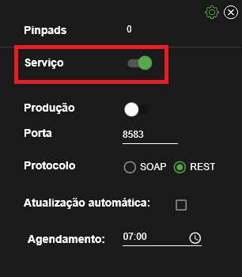

# kaner

## 1 Testes de usabilidade da interface

**Pré requisitos:**

   - Executar o serviço com o decorate habilitado;
   - 1x StoneCode de staging (habilitado para Microtef);
   - 1x StoneCode de produção (habilitado para Microtef).

### Scenario #1 - Trocar o protocolo de comunicação

   1. Troque o protocolo do serviço através da interface, para **SOAP**:
   
   
   
   2. Tente enviar uma requisição via SOAP, com o comando: **comando aqui**;
   3. Troque o protocolo de volta para **REST**;
   4. Tente enviar o comando novamente e verifique que um erro foi encontrado;
   5. Envie a requisição via **REST**, utilizando o **postman**;
   6. Verifique se a mensagem "**Test Scenario #1**" foi mostrada no display do pinpad;
   7. Altere o protocolo de volta para **SOAP**.

### Scenario #2 - Trocar a porta do serviço

   1. Troque a porta do serviço para a porta **1234**: 
   
   
   
   2. Tente enviar uma requisição para a porta **4321**, com o comando: **comando aqui**; 
   3. Verifique que um erro foi encontrado;
   4. Tente enviar uma requisição para a porta **1234**, com o comando: comando aqui;
   5. Verifique se a mensagem "**Test Scenario #2**" foi mostrada no display do pinpad.

### Scenario #3 - Desabilitar o serviço

   1. Desabilite o serviço: 
   
   
   
   2. Tente enviar uma requisição, com o comando: **comando aqui**;
   3. Verifique que um erro foi encontrado;
   4. Tente enviar uma requisição, com o comando: **comando aqui**;
   5. Verifique se a mensagem "**Test Scenario #3**" foi mostrada no display do pinpad.

### Scenario #4 - Utilizar modo desenvolvedor

   1. Desabilite a opção "Produção":

   

   2. Tente passar uma transação com um **StoneCode de Staging**, com o comando: **comando aqui**;
   3. Verifique se a transação foi bem sucedida;
   3. Habilite a opção "**Produção**";
   4. Tente passar uma transação com um **StoneCode de Produção**, com o comando: **comando aqui**;
   5. Verifique se a transação foi bem sucedida (a transação será cancelada em seguida automaticamente).

## 2 Testes de conexão com o pinpad

**Pré requisitos:**

   - 1x pinpad USB;
   - 1x iWL 250 (pinpad bluetooth com impressora).

### Scenario #5 - GetOneOrFirstPinpad

:warning: **Testar com e sem o decorate.**

**Decorate desabilitado:**

   1. Enviar o comando: **comando aqui**;
   2. Validar se um pinpad (provavelmente o pinpad cabeado) foi conectado e mostra a label "**Test Scenario #5**" no display.

**Decorate habilitado:**

   1. Enviar o comando: **comando aqui**;
   2. Validar se um pinpad (provavelmente o pinpad cabeado) foi conectado e mostra a label "**Test Scenario #5**" no display;
   3. Verificar se na interface é mostrado que **um** pinpad foi conectado;
   4. Verificar se uma **notificação** foi lançada ao conectar o pinpad.

### Scenario #6 - GetAllPinpads

:warning: **Testar com e sem o decorate.**

**Decorate desabilitado:**

   1. Enviar o comando: **comando aqui**;
   2. Validar se os dois pinpads foram conectados e mostram a label "**Test Scenario #6**" nos displays.

**Decorate habilitado:**

   1. Enviar o comando: **comando aqui**;
   2. Validar se os dois pinpads foram conectados e mostram a label "**Test Scenario #6**" nos displays;
   3. Validar se na interface é mostrado que **dois** pinpads foram conectados;
   4. Verificar se uma **notificação** foi lançada ao conectar os pinpads.

### Scenario #7 - Ping

:warning: **Chamar um dos métodos de conexão (se não foram chamados antes).**

   1. Desconecte o pinpad a ser testado;
   2. Envie o comando: **comando aqui**;
   3. Valide que o comando retornou **erro**;
   4. Conecte o pinpad novamente;
   5. Envie o comando: **comando aqui**;
   6. Valide que o comando retornou **sucesso**;
   7. Valide que o pinpad mostra a label "**Test Scenario #7**".

### Scenario #12 - ClosePinpadConnection

:warning: **Testar com e sem o decorate.**

**Decorate desabilitado:**

   1. Envie o comando: **comando aqui**;
   2. Envie o comando: **comando aqui**;
   3. Valide que um erro ocorreu;
   4. Envie o comando: **comando aqui**;
   5. Envie o comando: **comando aqui**;
   6. Valide que o display do pinpad mostra a mensagem "**Test Scenario 12**".

**Decorate habilitado:**

   1. Envie o comando: **comando aqui**;
   2. Envie o comando: **comando aqui**;
   3. Valide que um erro ocorreu;
   4. Validar se a interface indica que o número de pinpads conectados foi **subtraído**;
   5. Envie o comando: **comando aqui**;
   6. Envie o comando: **comando aqui**;
   7. Validar se a interface indica que o número de pinpads conectados foi **incrementado**;
   8. Valide que o display do pinpad mostra a mensagem "**Test Scenario 12**".

## 3 Testes de autorização com o pinpad

**Pré requisitos:**

   - Desabilite a opção de produção na interface. 
     
   :warning: Considere deixar para produção se o ambiente de integração estiver indisponível.

### Scenario #8 - Leitura do cartão

   1. Envie o comando: **comando aqui**;
   2. Digite o numero impresso no cartão (**PAN**);
   3. Passe o cartão;
   4. Verifique se o teste indicou falha ou sucesso.

### Scenario #9 - Leitura da senha

   1. Envie o comando: **comando aqui**;
   2. Digite a senha do cartão solicitada no pinpad;
   3. Verifique se algum erro foi encontrado.

### Scenario #10 - Envio da autorização

   1. Envie o comando: **comando aqui**;
   2. Verifique se a transação foi aprovada corretamente.

### Scenario #11 - Cancelamento

   1. Envie o comando: **comando aqui**;
   2. Passe o cartão;
   3. Insira a senha;
   4. Verifique que a transação foi aprovada;
   5. O pinpad irá solicitar confirmação para o cancelamento, confirme apertando na tecla **ENTER**;
   6. Verifique se o cancelamento foi aprovado.